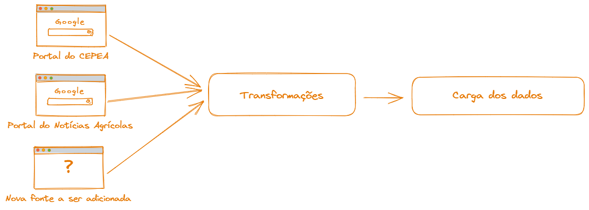
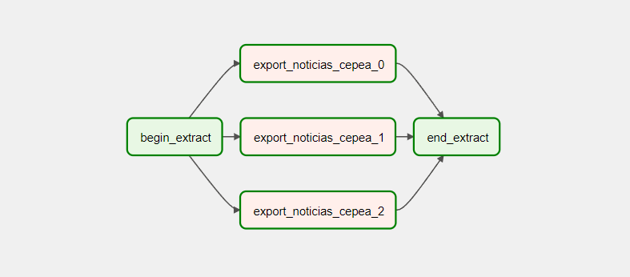
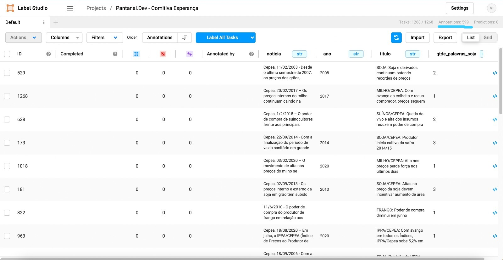

# 🐱‍👤 Dados

Com a proposta da solução definida, foi necessário definir a arquitetura da plataforma de dados que irá suportar a solução, bem como quais dados, modelos e ferramentas serão utilizados para a construção da solução.

## Fonte de dados

Foi realizado uma busca de dados abertos que pudessem ser utilizados para a construção da solução em sites como [Kaggle](https://kaggle.com), [UCI Machine Learning Repository](https://archive.ics.uci.edu/ml/index.php) e [Google Dataset Search](https://datasetsearch.research.google.com/). Entretanto, não foi encontrado nenhum dataset que atendesse aos requisitos necessários para a construção da solução, como por exemplo: dados em português, dados de notícias referente a Soja, bem como uma classificação de sentimento para essas notícias que tivesse o ponto de vista do produtor rural/trading.

### CEPEA - Centro de Estudos Avançados em Economia Aplicada

Com a necessidade de treinarmos o modelo utilizando o máximo de fontes que não houvesse viés político, foi encontrado o site do CEPEA, que é um centro de estudos avançados em economia aplicada, que é uma instituição de pesquisa da USP. O CEPEA possui uma [página de boletins diários](https://www.cepea.esalq.usp.br/br/categoria/diarias-de-mercado.aspx), chamada Diárias do Mercado, que são publicações diárias sobre o mercado de commodities agrícolas, como soja, milho, café, etc. Esses boletins são publicados diariamente desde 1997.

### Notícias Agricolas

Além do CEPEA, foi encontrado o site [Notícias Agricolas](https://www.noticiasagricolas.com.br/), que é um portal de notícias sobre o agronegócio brasileiro. Esse portal possui uma seção de notícias sobre soja, que são publicadas diariamente desde 2006. Essa fonte de notícias é interessante pois possui uma visão mais voltada para o produtor rural, diferente do CEPEA que possui uma visão econômica.
O Notícias Agricolas possui um grande volume de notícias que são de outras fontes como [Reuters](https://www.reuters.com/), o que pode ser interessante para o treinamento do modelo, uma vez que podemos regras para o mercado internacional da commodity.

## Coleta de dados

### Introdução

Para realizar a coleta de dados das plataformas acima, foi necessário a utilização da ferramenta [Apache Airflow](https://airflow.apache.org/), que é uma plataforma de orquestração de fluxos de trabalho (workflow) de código aberto que permite aos usuários programar, agendar e monitorar tarefas em fluxos de trabalho complexos. Essa ferramenta foi escolhida pois suas vantagens permite com que o processo de coleta seja escalável, flexível e com monitoramento em tempo real.
As tarefas de coleta de dados foram divididas em 3 etapas:

- [Coleta de dados do CEPEA](https://github.com/comitivaesperanca/data/blob/main/airflow/dags/data_engineering/scrapping_cepea.py)
- [Coleta de dados do Notícias Agricolas](https://github.com/comitivaesperanca/data/blob/main/airflow/dags/data_engineering/scrapping_noticias_agricolas.py)

Para cada fonte de dados, foi necessário criar uma DAG (Directed Acyclic Graph) que é um fluxo de trabalho que define como as tarefas serão executadas, para cada fonte de dados. Essas DAGs foram criadas utilizando a sintaxe de Python, e utilizam bibliotecas como BeautifulSoup, Pandas e Requests para realizar a coleta de dados.

O processo de fluxo de dados ficou da seguinte forma:

### Processo de coleta

Para executar a primeira carga de dados completa, foi necessário parametrizar as DAGs para buscar os dados desde 1997, para o CEPEA, e desde 2006, para o Notícias Agricolas. Após a execução da primeira carga de dados, as DAGs foram parametrizadas para buscar os dados apenas do dia anterior, para que o processo de coleta seja incremental.

Na imagem acima, é possível visualizar a DAG desenvolvida para a coleta de dados do CEPEA e do Notícias Agricolas. Essas DAGs são executadas diariamente, e a cada execução, os dados do dia anterior são coletados e armazenados localmente, podendo vir a ser carregado a um banco de dados ou a um data lake.

### Análise exploratória
Ao concluir a carga incremental do CEPEA, foi possível obter 7639 notícias, desde Julho de 2006 até a presente data, conforme o gráfico abaixo:
<iframe width=700, height=500 frameBorder=0 src="../assets/images/quantidade_noticias_cepea.html"></iframe> 

Já o Notícias Agricolas, foi possível obter 23.601 notícias, conforme a imagem abaixo:
<iframe width=700, height=500 frameBorder=0 src="../assets/images/quantidade_noticias_agricolas.html"></iframe> 

Para iniciar o tratamento das notícias, de maneira que fosse possível filtrar apenas as notícias referentes a soja, foi necessário realizar uma análise exploratória dos dados, para entender quantas notícias houvesse Soja mencionada, ao menos duas vezes. No Dataset do CEPEA, foi possível encontrar 954 notícias que tivesse a palavra Soja mencionada ao menos duas vezes, conforme a imagem abaixo:
<iframe width=700, height=500 frameBorder=0 src="../assets/images/soja.html"></iframe>

No Dataset do Notícias Agricolas, foi possível encontrar 3.358 notícias que tivesse a palavra Soja mencionada ao menos duas vezes, conforme a imagem abaixo:
<iframe width=700, height=500 frameBorder=0 src="../assets/images/soja_na.html"></iframe>

### Rotulação dos dados
Para realizar a rotulação dos dados, foi utilizado a ferramenta [Label Studio](https://labelstud.io/), que é uma plataforma de marcação de dados (data labeling) de código aberto que permite criar tarefas de marcação de forma simples e escalável. 
Conforme o curto prazo para a entrega do projeto, foi necessário realizar a rotulação dos dados manualmente, porém, para uma entrega futura, é possível utilizar técnicas de NLP para realizar a rotulação dos dados de maneira automática, como por exemplo, utilizando o [Spacy](https://spacy.io/).

Devido ao grande volume, a equipe optou por classificar apenas as notícias do CEPEA, que possuía um volume menor de dados, e que possuía uma visão mais econômica, diferente do Notícias Agricolas, que pode possuir notícias com viés político.

Foi realizado o deployment da ferramenta Label Studio utilizando o serviço de Kubernetes da [Azure](https://azure.microsoft.com/pt-br/), e a rotulação dos dados foi realizada por 4 pessoas do time, conforme a imagem abaixo:

### Criação do modelo
Após a rotulação dos dados, foi necessário realizar o treinamento do modelo de Machine Learning, para que fosse possível criar o *Motor de Classificação* do Radar da Soja, que é o responsável por classificar as notícias em Positivo, Neutro ou Negativo. Com a necessidade de desenvolvermos um modelo utilizando BERT (através de redes neurais), o time optou por desenvolver um modelo baseline, para servir de efeito de comparação, utilizando o modelo [Naive Bayes Multinomial](https://scikit-learn.org/stable/modules/naive_bayes.html), que é um modelo de classificação probabilístico baseado no teorema de Bayes, que assume que a presença de uma característica em uma classe não está relacionada com a presença de qualquer outra característica.

#### Modelo Naive Bayes Multinomial (Baseline)
TBD

#### Modelo BERT
TBD

### Deploy do modelo
#### Pipeline de classificação
TBD
#### API de classificação
TBD