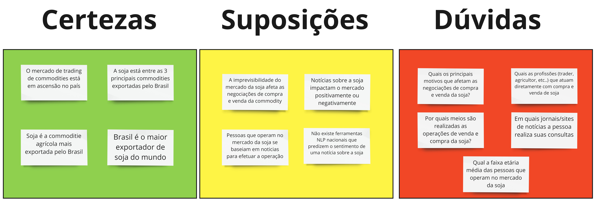
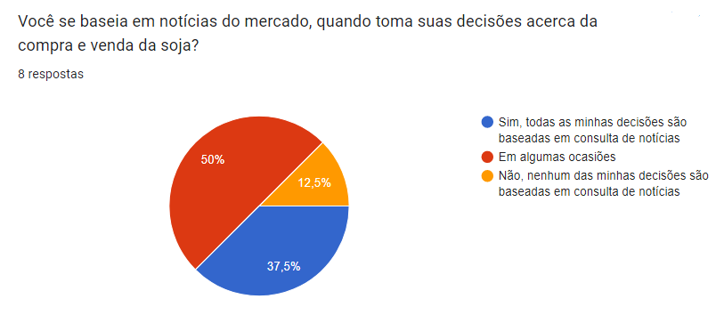

## ** Entendendo o mercado **
A partir de uma análise abrangente do mercado da soja, surgiram muitos *insights* sobre como poderíamos criar um produto que resolvesse os problemas mencionados no contexto geral. Considerando esses estudos de mercado, muitas perguntas e afirmações surgiram para nós da equipe e, afim de organizar nossas ideias, elaboramos uma matriz CSD que clusteriza as "Certezas", "Suposições" e "Dúvidas" de um determinado assunto.  

Essa Matriz CSD não só nos ajudou a esclarecer nossas ideias, mas também serviu como base para as pesquisas de mercado que conduzimos e para toda a descoberta do **Radar da Soja**.

 *Acima está ilustrado nossa Matriz CSD criada na ferramenta MIRO.* 
   

## **Pesquisa de mercado**
O objetivo dessa pesquisa foi responder as suposições e dúvidas da equipe Comitiva Esperança, principalmente sobre as pessoas que atuam com o mercado da soja e seus problemas enfretados.

Para realizar a pesquisa, foi criado um formulário no Google contendo diversas perguntas sobre questões relacionadas aos problemas encontrados mercado da soja, as pessoas que atuam com essa commodity e sobre as notícias desse mercado. O formulário foi divulgado inicialmente em grupos do **Facebook** e **WhatsApp** e, posteriormente, individualmente para cada pessoa nessas redes.

### **Estratégia para divulgação**
Durante o tempo vigente da pesquisa, foram utilizados duas estratégias distintas para divulgação da pesquisa.

A primeira estratégia utilizada foi divulgar a pesquisa em grupos relacionados ao agronegócio. No entanto, essa abordagem não se mostrou eficaz devido à falta de personalização e interação humana. Nós apenas compartilhamos o formulário nessas comunidades e esperamos pelas respostas, o que resultou em apenas uma **única resposta** obtida por meio desse método.

A segunda estratégia adotada consistiu em divulgar o formulário de maneira personalizada e humanizada, conversando individualmente com cada pessoa. Essa abordagem nos trouxe resultados significativos, pois as pessoas se sentiram envolvidas em algo maior, que era ajudar universitários a construir um produto valioso para eles. Como resultado dessa estratégia, conseguimos obter **9 respostas** para nossa pesquisa.

### **Números atingidos**
Uma das maiores dificuldades para a realização dessa pesquisa foi o contato com pessoas do mercado, isso reflete diretamente na taxa de resposta da pesquisa: foram enviadas **231 mensagens** individualizadas para participantes de grupos de agronegócio e obtivemos **10 respostas** em nosso formulário.

Isso demonstrou uma característica para esse grupo de pessoas, a falta de tempo. Normalmente ficam o dia inteiro atarefados com suas atividades de trabalho e não conseguem encontrar momentos para responder formulários em seu WhatsApp.
### **Pesquisa para entendimento do mercado**

Abaixo segue os dados obtidos para cada uma das perguntas realizadas.

*Pergunta realizada com o intuito de compreender a idade média das pessoas envolvidas com o mercado da soja*

   
---

*Pergunta realizada com o intuito de compreender quais eram os cargos/responsabilidades dos participantes*

   
---

*Pergunta realizada com o intuito de descobrir quais os principais meios de negociação da soja*

   
---

*Pergunta realizada com o intuito de entender quais os principais problemas que afetam as operações de compra e venda da soja*

   
---

 
*Pergunta criada para obter dados de visualização de notícias sobre o mercado da soja*

   
---

*Pergunta criada para entender se os participantes baseiam suas operações de compra e venda em notícias do mercado*

   
---

*Pergunta criada para obter dados dos sites com notícias da soja mais visitados*

   
---

*Pergunta criada para entender se os partipantes consideram a ideia do Radar da Soja útil e valiosa*

   
---

## **Resultado obtidos**

A pesquisa realizada com profissionais do mercado da soja trouxe importantes insights sobre as principais necessidades e problemas enfrentados por essas pessoas. 

Com base na pesquisa e após análise minuciosa dos dados coletados, nós da Comitiva Esperança tivemos a oportunidade de identificar os nossos potenciais usuários e clientes. 

Essas informações foram fundamentais para que pudéssemos criar um produto sob medida que atenda às necessidades desses consumidores e resolva os problemas encontrados.
## Tabela de Versionamento

  

    <table>
      <thead>
        <tr>
          <th>Data</th>
          <th>Versão</th>
          <th>Descrição</th>
          <th>Autor(es)</th>
        </tr>
      </thead>
    <tbody>
      <tr>
        <td>10/05/2023</td>
        <td>1.0</td>
        <td>Criação do documento</td>
        <td><a href="https://www.linkedin.com/in/vitor-lameirao/">Vitor Lameirão</a>
        </td>
      </tr>
    </tbody>
  </table>

