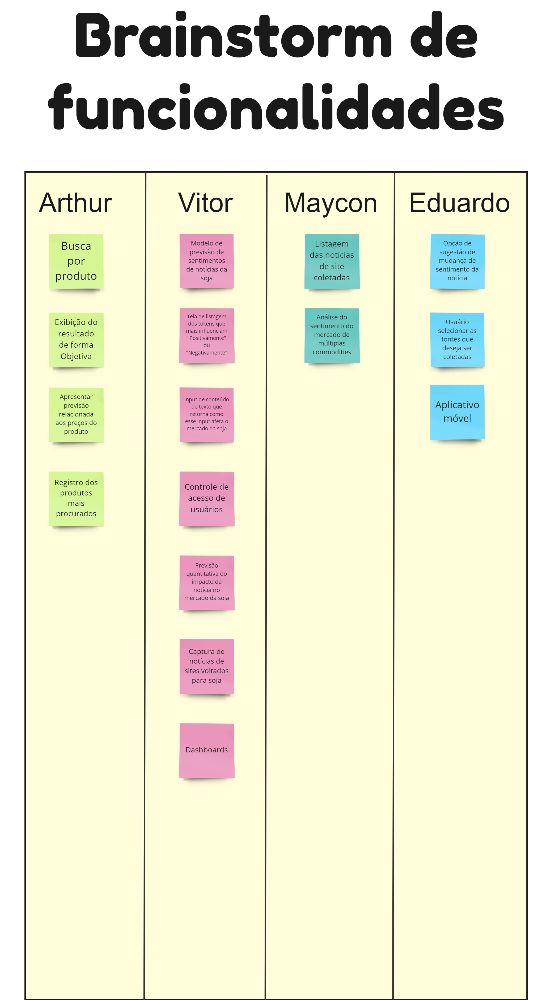

Após criarmos nossa *Visão do Produto*, que gerou um entendimento comum sobre o produto que será desenvolvido por toda a equipe Comitiva Esperança, seguimos para a segunda etapa da descoberta do *Radar da Soja*, o **Brainstorming de Funcionalidades**.

## **Aplicação do método**

Para aplicar o **Brainstorming de Funcionalidades**, criamos um quadro na ferramenta Miro, onde cada membro da equipe poderia imaginar e escrever uma funcionalidade que julgava ser valiosa para o produto. Nesta etapa, não validamos nenhuma das funcionalidades inseridas, pois o objetivo é coletar o máximo possível de ideias. Nas próximas etapas da descoberta, iremos refiná-las e priorizá-las.  

*Acima está ilustrado o nosso quadro de Brainstorming*

## Tabela de Versionamento

  

    <table>
      <thead>
        <tr>
          <th>Data</th>
          <th>Versão</th>
          <th>Descrição</th>
          <th>Autor(es)</th>
        </tr>
      </thead>
    <tbody>
      <tr>
        <td>15/05/2023</td>
        <td>1.0</td>
        <td>Criação do documento</td>
        <td><a href="https://www.linkedin.com/in/vitor-lameirao/">Vitor Lameirão</a>
        </td>
      </tr>
    </tbody>
  </table>

