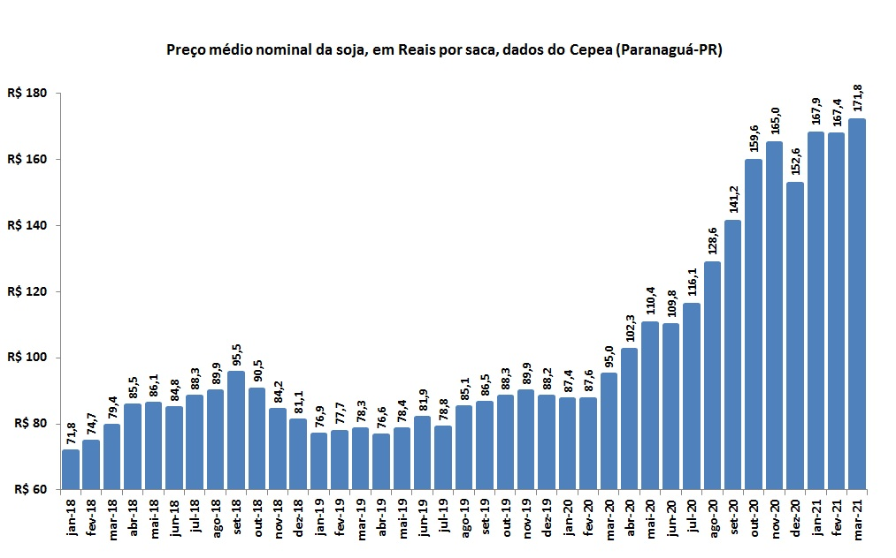

## **Mercado de Commodities**

### **O que são commodities**
Primeiramente, antes de entrar a fundo no mercado de commodities, vamos explicar o que são commodities.  
Também conhecidas como "matería-prima", as commodities, são produtos básicos e genéricos que são produzidos em grande quantidade e comercializados em mercados globais. Eles geralmente se referem a matérias-primas naturais ou agrícolas que são extraídas ou cultivadas, como petróleo, gás natural, ouro, prata, trigo, milho, soja, café, açúcar, entre outros.

### **Importância das commodities para o Brasil**
O mercado de commodities têm grande importância para todas as escalas economicas do país.  
Segundos dados do Ministério da Economia, no ano de 2022, o Brasil gerou **US$ 334 Bilhões** a partir de exportações das commodities. Esse valor gerado representa um total de **17%** de todo o PIB nacional daquele ano.  
Além de todo esse impacto ecônomico, o mercado de commodities geram, diretamente e indiretamente, milhões de empregos para a população brasileira.  
Por isso é vital que todo esse ecossistema seja apoiado por orgãos governamentais, iniciativas privadas, etc...

## **Mercado de commodities agrícolas**

### **O que são commodities agrícolas**
Commodities agrícolas são produtos básicos, geralmente produzidos em grandes quantidades e comercializados em escala global. Eles são cultivados em fazendas e incluem produtos como:

* Soja
* Trigo
* Café
* Milho
* Entre outros.

### **Importância das commodities agrícolas**
Dentre os **US$ 334 Bilhões** faturados a partir da exportação de commodities, **48%** de todo esse valor foram advindos das commodities agrícolas.  
O que revela uma grande relevância e importância do agronegócio para toda a economia do país.

## **Mercado da soja**

### **Contexto geral do mercado da soja**
O mercado da soja é de extrema importância para a economia brasileira, sendo um dos principais produtos exportados pelo país. O Brasil é atualmente o maior produtor e exportador mundial de soja, com uma produção média de 130 milhões de toneladas por ano e, segundo dados da Secretária de Comércio Exterior (SECEX), nosso país faturou US$ 46,69 bilhões com a venda dessa commodity em 2022.    
A exportação da soja representa uma grande parcela das receitas de exportação do Brasil, o que faz com que a volatilidade do mercado da soja tenha um impacto significativo na economia do país. 

### **Dificuldades e problemas encontrados no mercado**
A volatibidade do mercado pode afetar diretamente as operações de compra e venda dessa commodity, essa imprevisibilidade pode gerar incertezas e inseguraças para os dependentes desse mercado quando forem realizar uma operação de compra ou venda da soja.   
Essa insegurança e incerteza causada no mercado está muito relacionada com notícias que afetam diretamente o mercado da soja. Informações sobre possíveis condições climáticas impróprias para o cultivo, aumento dos custos de produção, retomada de negociações entre países produtores de soja e, até mesmo pandemias, causam um desconforto no mercado e fazem com que as operações de compra e venda da commodity tenham mais riscos do que o padrão.   

 *Acima encontra-se dados do CEPEA sobre a variação do preço da soja em 3 anos.* 
   

Como mostrado no gráfico, o mercado da soja é muito imprevisível, principalmente quando analisamos o seu preço de venda, por isso, qualquer ferramenta que apoie as decisões de compra e vendas no mercado da soja é totalmente útil e valiosa para as pessoas que realizam essas operações.  
Nesse sentido que o **Radar da Soja** surge para auxiliar milhares de pessoas que dependem desse mercado para gerar lucro pessoal e para suas empresas.  

## Tabela de Versionamento

  

    <table>
      <thead>
        <tr>
          <th>Data</th>
          <th>Versão</th>
          <th>Descrição</th>
          <th>Autor(es)</th>
        </tr>
      </thead>
    <tbody>
      <tr>
        <td>10/05/2023</td>
        <td>1.0</td>
        <td>Criação do documento</td>
        <td><a href="https://www.linkedin.com/in/vitor-lameirao/">Vitor Lameirão</a>
        </td>
      </tr>
    </tbody>
  </table>

