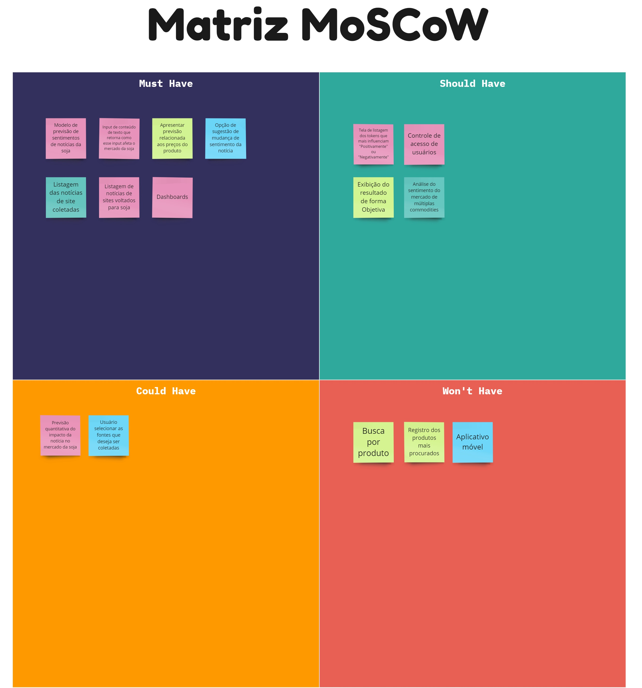
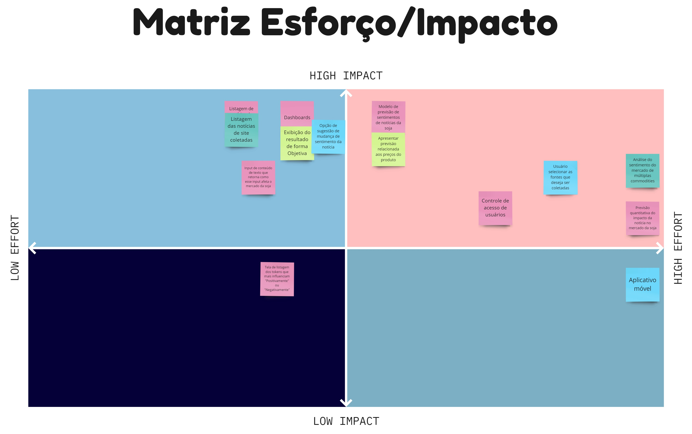

Após realizarmos a fase de **Brainstorming de Funcionalidades**, seguimos para a próxima etapa de descoberta do *Radar da Soja*. Nesta etapa, priorizamos e definimos quais funcionalidades idealizadas farão parte do nosso produto utilizando duas técnicas amplamente utilizadas no mercado: **Matriz MoSCoW** e **Matriz de Esforço e Impacto**.

## Matriz MoSCoW
A **Matriz MoSCoW** é uma ferramenta utilizada para ajudar a priorizar as funcionalidades de um produto. A matriz divide os requisitos/funcionalidades em quatro categorias principais: Must Have (deve ter), Should Have (deveria ter), Could Have (poderia ter) e Won't Have (não terá).  

* Must Have: são essenciais para o sucesso do projeto e devem ser implementados;
* Should Have: são importantes, mas não críticos, e podem ser adiados se necessário;
* Could Have: são desejáveis, mas não são essenciais, e podem ser descartados ou adiados sem afetar significativamente o sucesso do projeto;
* Won't Have:  são aqueles que não serão incluídos no produto atual.  

Abaixo está detalhado a nossa **Matriz MoSCoW** de priorização.

*Quadro criado utilizando o Miro*

## **Matriz de Esforço e Impacto**
A **matriz de esforço e impacto** é uma ferramenta usada para avaliar as funcionalidades de um produto e classificá-las com base em dois critérios principais: o esforço necessário para desenvolve-lo e o impacto que ela terá no produto.

O esforço é medido pela quantidade de tempo, recursos e pessoal necessário para desenvolver a funcionalidade e o impacto é medido pela importância da funcionalidade para o sucesso geral do produto.

A matriz de esforço e impacto é geralmente apresentada como uma matriz de duas dimensões, com o esforço representado no eixo horizontal e o impacto no eixo vertical. As funcionalidades são então classificadas em quatro categorias principais:

* Alto esforço, alto impacto: funcionalidades críticas que exigem muitos recursos e têm um grande impacto no produto;
* Baixo esforço, alto impacto: funcionalidades importantes, mas relativamente fáceis de executar;
* Alto esforço, baixo impacto: funcionalidades secundárias que podem ser adiadas ou eliminadas se necessário;
* Baixo esforço, baixo impacto: funcionalidades triviais que não são essenciais para o sucesso do produto.

Abaixo está detalhado a nossa **Matriz de Esforço e Impacto** de priorização.

*Quadro criado utilizando o Miro*

## Tabela de Versionamento

  

    <table>
      <thead>
        <tr>
          <th>Data</th>
          <th>Versão</th>
          <th>Descrição</th>
          <th>Autor(es)</th>
        </tr>
      </thead>
    <tbody>
      <tr>
        <td>19/05/2023</td>
        <td>1.0</td>
        <td>Criação do documento</td>
        <td><a href="https://www.linkedin.com/in/vitor-lameirao/">Vitor Lameirão</a>
        </td>
      </tr>
    </tbody>
  </table>

