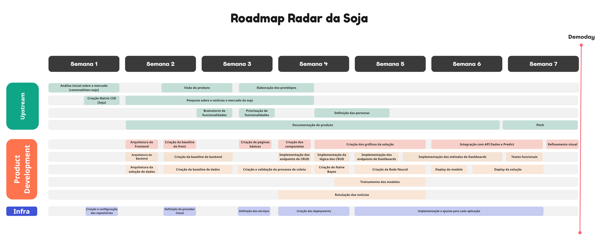

Após conclusão do processo inicial de descoberta do *Radar da Soja*, obtivemos informações suficientes para criar um Roadmap detalhado das atividades de cada uma das Stacks de desenvolvimento.

Para criação desse roadmap, utilizamos as tarefas que foram criadas no GitHub Projects e analisamos todo nosso processo de desenvolvimento que será desenvolvido até o final do programa [</pantanal.dev\>](https://pantanal.dev).

Abaixo está detalhado o nosso Roadmap do Produto, onde estão separados atividades em 3 frentes:

* Upstream: Time responsável pela investigação de mercado, a identificação de oportunidades, a definição de requisitos e especificações do produto e a análise de concorrentes;
* Product Development: Time responsável pelo desenvolvimento da solução idealizada;
* Infra: Time responsável por toda criação e configuração dos servidores, bancos de dados e outros componentes de software e nuvem utilizados no projeto.

*Quadro criado utilizando o Miro*

## Tabela de Versionamento

  

    <table>
      <thead>
        <tr>
          <th>Data</th>
          <th>Versão</th>
          <th>Descrição</th>
          <th>Autor(es)</th>
        </tr>
      </thead>
    <tbody>
      <tr>
        <td>19/05/2023</td>
        <td>1.0</td>
        <td>Criação do documento</td>
        <td><a href="https://www.linkedin.com/in/vitor-lameirao/">Vitor Lameirão</a>
        </td>
      </tr>
    </tbody>
  </table>

