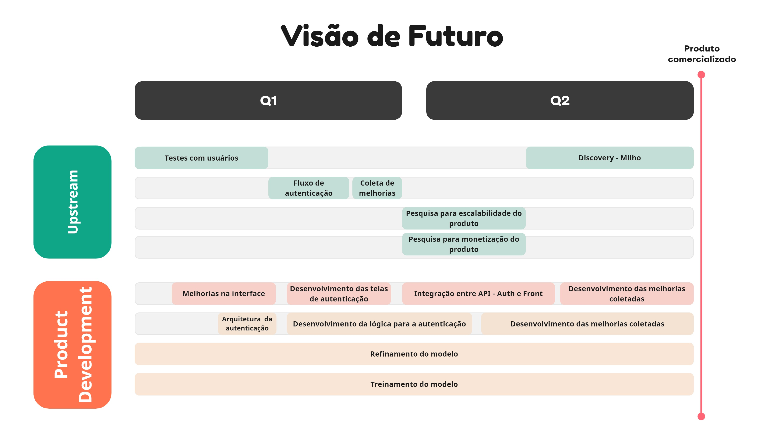

Nós, da equipe *Comitiva Esperança*, acreditamos fortemente que o Radar da Soja, um produto criado para participar do programa [</pantanal.dev\>](https://pantanal.dev), tem grande potencial para se expandir e se tornar rentável para o nosso time.

Não pretendemos descontinuar esse produto após a conclusão do programa. Por isso, com base em toda a descoberta inicial feita para o Radar da Soja, criamos um Roadmap Futuro para o próximo semestre.

Com esse Roadmap, conseguimos nos planejar e mapear tudo o que precisará ser feito para alcançarmos nosso objetivo de 6 meses: **comercializar o Radar da Soja**.

Abaixo está detalhado todas as atividades que precisarão ser realizadas para alcançarmos nosso sonho com o *Radar da Soja*.

*Quadro criado utilizando o Miro*

## Tabela de Versionamento

  

    <table>
      <thead>
        <tr>
          <th>Data</th>
          <th>Versão</th>
          <th>Descrição</th>
          <th>Autor(es)</th>
        </tr>
      </thead>
    <tbody>
      <tr>
        <td>19/05/2023</td>
        <td>1.0</td>
        <td>Criação do documento</td>
        <td><a href="https://www.linkedin.com/in/vitor-lameirao/">Vitor Lameirão</a>
        </td>
      </tr>
    </tbody>
  </table>

