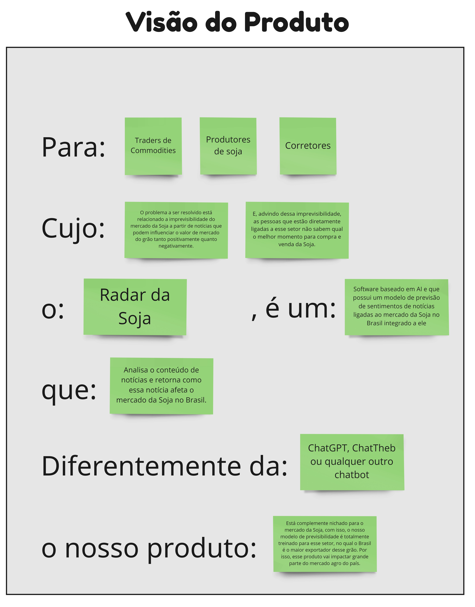

Ao analisarmos os dados coletados em nossas pesquisas de mercado, observamos que há uma grande insatisfação dos entrevistados com a imprevisibilidade do mercado da soja, além do impacto negativo de algumas notícias sobre as operações de compra e venda desse produto. Com base nesses insights, a equipe da **Comitiva Esperança** idealizou um produto que soluciona esses problemas e atende às necessidades de Jorge e Breno, nossas personas.

Com todas essas informações nós desenvolvemos uma das etapas do método de descoberta de produto chamado *Lean Inception*, que é a definição da *Visão do Produto* para que a nossa ideia seja clara e objetiva e, com essa visão inicial e detalhada, possamos guiar todas as funcionalidades do nosso produto para que atendam essão definição inicial.

 *Acima está ilustrado nosso quadro de Visão do Produto criado na ferramenta MIRO.* 
   

## Tabela de Versionamento

  

    <table>
      <thead>
        <tr>
          <th>Data</th>
          <th>Versão</th>
          <th>Descrição</th>
          <th>Autor(es)</th>
        </tr>
      </thead>
    <tbody>
      <tr>
        <td>10/05/2023</td>
        <td>1.0</td>
        <td>Criação do documento</td>
        <td><a href="https://www.linkedin.com/in/vitor-lameirao/">Vitor Lameirão</a>
        </td>
      </tr>
    </tbody>
  </table>

