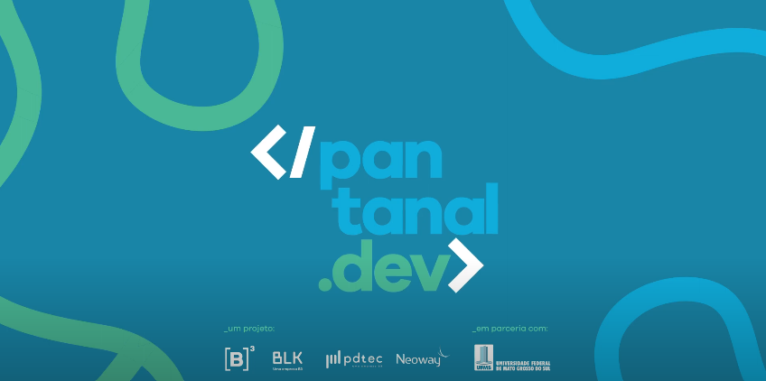

---
hide:
  - navigation
  - toc
---

# Comitiva Esperança 🌟

Organização destinada ao time Comitiva Esperança do programa [</pantanal.dev\>](https://pantanal.dev) 🚀, um programa de capacitação imersiva em tecnologias inovadoras que tem como objetivo capacitar e apresentar oportunidades de trabalho remoto no mercado financeiro nacional 💼.  

  

## **Sobre o desafio [</pantanal.dev\>](https://pantanal.dev)**

Entre os dias **01/04/2023** e **20/05/2023**, foi realizado o módulo Arara Azul, focado em **Machine Learning**, do programa [</pantanal.dev\>](https://pantanal.dev), um programa desenvolvido por professores da Faculdade de Computação da UFMS em parceira com as empresas [B3 a bolsa do Brasil](https://www.linkedin.com/company/b3_oficial/), [BLK](https://www.linkedin.com/company/blk-b3/), [PDtec](https://www.linkedin.com/company/pdtec-b3/) e [Neoway](https://www.linkedin.com/company/neoway/).  
Durante esse período foi proposto a nós do time Comitiva Esperança e a outras 9 equipes, o desafio de ***"Treinar um algoritmo de Machine Learning capaz de classificar o sentimento de textos de notícias de Jornais ou Redes Sociais em (Positivo, Neutro ou Negativo)"***.   
Cabia a cada time definir e construir um produto que resolva um problema real e entregue valor aos seus usuários com esse modelo proposto.  

## **Participantes** 🙋‍♀️🙋‍♂️

O time Comitiva Esperança é composto por 4 pessoas, de áreas multidisciplinares. Todos atuam como Data Scientist porém exercem o papel primário descrito abaixo:

<table>
    <tbody>
    <tr>
        <td align="center"><a href="https://www.linkedin.com/in/vitor-lameirao/">
         <b>Vitor Lameirão</b>  
        Engenharia de Software  
        <b>Product Owner</b>
        </a> </td>

        <td align="center"><a href="https://www.linkedin.com/in/mfelipemota/">
         <b>Maycon Felipe Mota</b>  
        Engenharia de Software  
        <b>Data Engineer</b>
        </a> </td>

        <td align="center"><a href="https://www.linkedin.com/in/godoydud/">
         <b>Eduardo Godoy</b>  
        Engenharia de Software  
        <b>Backend Engineer</b>
        </a> </td>

        <td align="center"><a href="https://www.linkedin.com/in/arthur-ramires-rodrigues-neto-9687a1193/">
         <b>Arthur Ramires</b>  
        Sistema de Informação 
        <b>Frontend Engineer</b>

        </td>

  <td align="center"><a href="https://www.linkedin.com/in/andrezzaandrade//">
         <b>Andrezza Andrade</b>  
        Neoway 
        <b>👑 Mentora</b>

        </td>

    </tr>
  </tbody>
  </table>
  

  

          
## Repositórios
As aplicações da plataforma está dividida em quatro repositórios, como:

- [Dados](https://github.com/comitivaesperanca/data)
- [Backend](https://github.com/comitivaesperanca/backend)
- [Frontend](https://github.com/comitivaesperanca/frontend)
- [Documentação](https://github.com/comitivaesperanca/docs)

## Tabela de Versionamento

  

    <table>
      <thead>
        <tr>
          <th>Data</th>
          <th>Versão</th>
          <th>Descrição</th>
          <th>Autor(es)</th>
        </tr>
      </thead>
    <tbody>
      <tr>
        <td>03/05/2023</td>
        <td>1.0</td>
        <td>Criação do documento</td>
        <td><a href="https://www.linkedin.com/in/vitor-lameirao/">Vitor Lameirão</a>
        </td>
      </tr>
    </tbody>
  </table>

